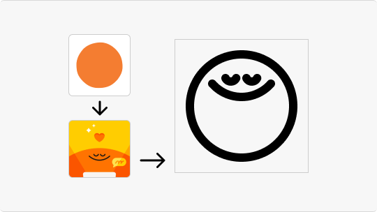

# Lawnicons contributing guide
Welcome to the Lawnicons contributing guide! This file will tell you what you need to know to contribute to Lawnicons.

Before you start, please [fork](https://github.com/LawnchairLauncher/lawnicons/fork) the project and clone it to your machine. Afterwards, you can either contribute icons or code.

## Contributing icons
To contribute icons, you only need an icon editor, a file explorer, a text editor, and a terminal window.

For additional information on designing icons and samples, see [the Lawnicons Figma repository](https://www.figma.com/community/file/1227718471680779613) made by [Grabstertv](https://github.com/Grabstertv).

### Artboard & Grid


Each icon must fit the `160x160px` or `144x144px` (depending on the shape) content area size. It must not be smaller nor bigger than the specified sizes.

### Foundation


The stroke should be kept at `12px` in most cases. If `12px` is too thick, a stroke of `8px` can be used.
For finer detail, a stroke of `6px` can be used. The standard widths are `6px`, `8px`, `10px`, `12px` and `14px`.

In addition to the above, joins and start/end points must be rounded and the colour must be black `#000000`. 

### Details


When designing icons, it's important to strike a balance with the level of detail. While some icons can be highly detailed, it's acceptable to remove certain details as long as the icon remains recognizable and stays true to its original concept. In some cases, you may need to completely rethink the icon to achieve a minimalist design.

A great example of this is the Subway Surfers icon as seen in the example above. In Lawnicons, it was reimagined by using the graffiti-styled "S" from the game's logo instead of depicting the character, which would have required intricate shapes and varying stroke thicknesses.



In contrary, it's also important to avoid too few details, as they may not be easily recognizable. Take the Headspace icon, for instance, which consists only of a circle. This may pose a problem for users since Lawnicons are not colored, and a simple circle on its own is not easily identifiable. Whenever possible, incorporate additional details that align with the app's design language. 

In the Headspace example above, the circles usually have a face representing mood. By adding one of those faces to the circle, you can make the icon more recognizable.

### Maintaining Consistency


All icons must adhere to an outline (not filled) to maintain a consistent theme. However, fill can be used sparingly for small details that require minimal contrast or for elements that cannot be accurately recreated with an outline. 

The key is to ensure that any filled elements do not overwhelm the overall icon design and align with the outlined style to create a harmonious and coherent icon set.

### Maintaining Visual Balance


Sharp contrast occurs when there is a drastic change in stroke thickness without a smooth transition. For instance, using a `12px` stroke and suddenly decreasing it to `8px` creates an unbalanced visual effect in the final icon.

To avoid sharp contrast, you can follow either of these two methods:

1. **Uniform Stroke:** Instead of jumping between stroke thicknesses, use the next immediate increment in width. For example, transition from *12px* to *10px*.
2. **Gradual Transition:** Rather than making a large jump, introduce an intermediate thickness. By going from `12px` to `10px` and then to `8px` you create a gradual transition or gradation. This approach helps maintain visual balance in your icon design.

## Adding an icon to Lawnicons
Here's how to add an icon to Lawnicons:

### Prerequesties
* Your icon in the SVG format, adhering to the [above guidelines](#icon-guidelines). The filename must use snake case (e.g. `files_by_google.svg`).
* The package and activity name of the app.

### Via `icontool.py`
Please check the [icon tool guide](/.github/icontool_guide.md) for more information.

### Via manual process
1. Add the ready SVG to the `svgs` directory.

1. Add a new line to `app/assets/appfilter.xml` (in alphabetical order, by the `name` attribute), and map the new icon to a package name and app's activity. For example:

    ```xml
      <item component="ComponentInfo{com.google.android.apps.nbu.files/com.google.android.apps.nbu.files.home.HomeActivity}" drawable="files_by_google" name="Files by Google"/> 
    ```

    A general template is as follows:

    ```xml
    <item component="ComponentInfo{[PACKAGE_NAME]/[APP_ACIVITY_NAME]}" drawable="[DRAWABLE NAME]" name="[APP NAME]"/> 
    ```

1. Done! You're ready to open a pull request. Please set `develop` as the base branch.

## Finding the package and activity name of an app
### Using `adb`
1. Connect your Android device or emulator to your laptop/desktop PC that has `adb` installed (see [this tutorial](https://www.xda-developers.com/install-adb-windows-macos-linux/) for more information) and open the app whose details you want to inspect, e.g. Telegram.
1. Open a new Command Prompt or Terminal window and input `adb devices`.
1. Finally, type the below-given command to get the information about the currently open application.

  **For Mac or Linux**:

  ```console
  adb shell dumpsys window | grep 'mCurrentFocus'  
  ```

  **For Windows**:

  ```console
  adb shell dumpsys window | find "mCurrentFocus"
  ```
  

  The part before the `/` character in the above image, i.e. `org.telegram.messenger`, is the package name (`[PACKAGE_NAME]`). The part after it, i.e. `org.telegram.messenger.DefaultIcon`, is the activity name (`[APP_ACIVITY_NAME]`).

### Using 3rd-party apps
#### IconRequest app
1. Download the [IconRequest app](https://github.com/Kaiserdragon2/IconRequest/releases). 
2. Launch the app and click "REQUEST NEW" or "UPDATE EXISTING".
3. Get the Activity details for each app.


  
#### Icon Pusher app
1. Download the [Icon Pusher app](https://play.google.com/store/apps/details?id=dev.southpaw.iconpusher&hl=en&gl=US).
2. Launch the app.
3. Select the icon(s) you want to upload or select all by pressing the square in the top right. Then press "Send".
4. View the Activity details for each app on the [Icon Pusher website](https://iconpusher.com/). Please make sure the `drawable="[DRAWABLE NAME]"` matches the icon SVG file name.

## Contributing code
While adding icons is the main focus for most contributors, code-related contributions are welcome.

Before building the app, ensure that you create the icon drawables by running:

```console
./gradlew svg-processor:run
```

Afterwards, you can build the app by selecting the `appDebug` build variant.

Here are a few contribution tips:
- [The `app` module](https://github.com/LawnchairLauncher/lawnicons/tree/develop/app) contains most of Lawnicons' core code, while [the `svg-processor` module](https://github.com/LawnchairLauncher/lawnicons/tree/develop/svg-processor) contains the code that converts the SVGs inside the `svgs` folder into Android Drawables. Generally, the `app` module is where you should make most of your contributions.
- You can use either Java or, preferably, Kotlin.
- Make sure your code is logical and well formatted. If using Kotlin, see ["Coding conventions"](https://kotlinlang.org/docs/coding-conventions.html) in the Kotlin documentation.
- Set `develop` as the base branch for pull requests.
- Significant changes to the UI should be discussed on our [Lawnchair's Telegram group chat](https://t.me/lawnchairci). Generally, we want to keep things clean and simple.
