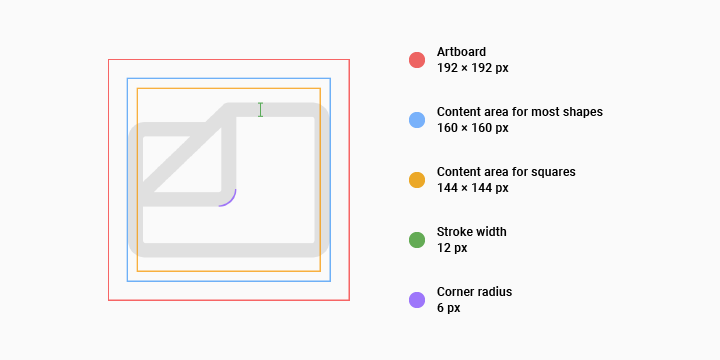
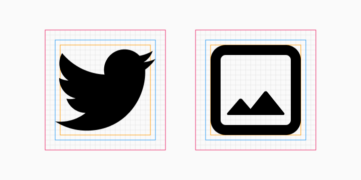
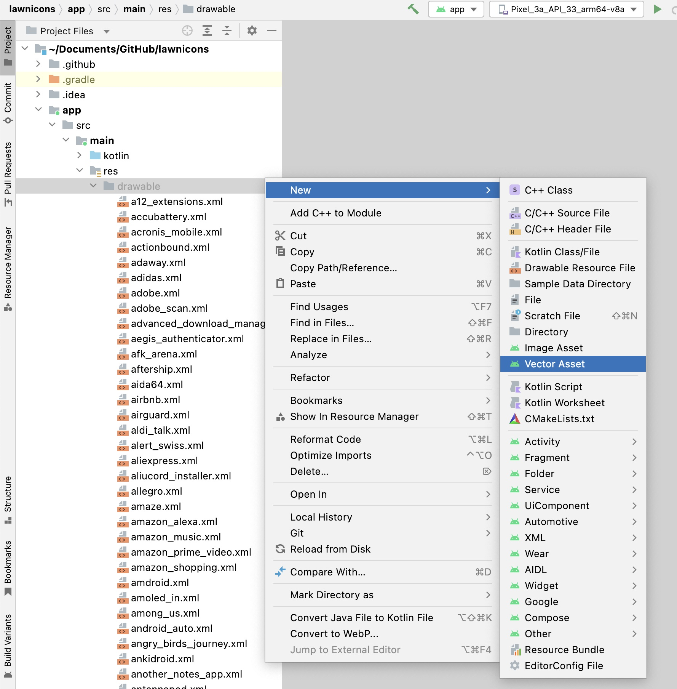

Here’s how to add an icon to&nbsp;Lawnicons.

1. Prepare your icon in the SVG format, adhering to the following guidelines. Use snake case for the filename (e.g.,&nbsp;`youtube_music.svg`).

    

1. Add the ready SVG to the `svgs`&nbsp;directory.

1. Using Android Studio, convert the SVG to an XML drawable, and add the XML drawable to the `app/src/main/res/drawable` directory. Use snake case for the drawable name (e.g., `youtube_music`). You can keep all settings at their&nbsp;defaults.

     

1. Add a new line to `app/src/main/res/xml/grayscale_icon_map.xml`, and map the new icon to a package name and app name. For&nbsp;example:

    ```xml
    <icon drawable="@drawable/twitter" package="com.twitter.android" name="Twitter" />
    ```

    A general template is as&nbsp;follows:

    ```xml
    <icon drawable="@drawable/[DRAWABLE NAME]" package="[PACKAGE NAME]" name="[APP NAME]" />
    ```

1. Done! You’re ready to open a pull request. Please set `develop` as the base&nbsp;branch.