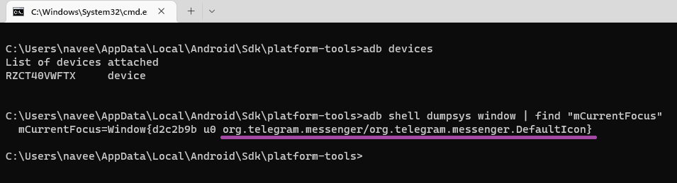
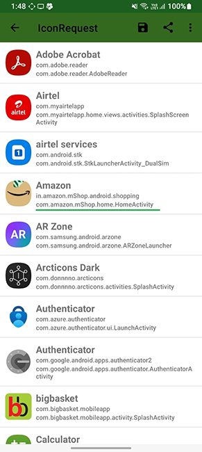

# Lawnicons contributing guide
Welcome to the Lawnicons contributing guide! This file will tell you  what you need to know to contribute to Lawnicons.

## Icon guidelines
See the below image for a summary of the icon guidelines. If you don't follow them, a team member will likely request changing the icons.


The stroke should be kept at 12px for most lines. If 12px is too thick, a stroke of 8px can be applied.

In addition to the above, the icons must have an outlined (not filled) style. If the original icon has a filled style, you should change the icon to adhere to the guidelines as seen below.


## Adding an icon to Lawnicons
Here’s how to add an icon to&nbsp;Lawnicons:

1. Prepare your icon in the SVG format, adhering to the [above guidelines](#icon-guidelines). Use snake case for the filename (e.g.,&nbsp;`youtube_music.svg`).

1. Add the ready SVG to the `svgs`&nbsp;directory.


1. Add a new line to `app/assets/appfilter.xml` (in alphabetical order), and map the new icon to a package name and app's activity. For&nbsp;example:

    ```xml
    <item component="ComponentInfo{app.lawnchair.lawnicons/app.lawnchair.lawnicons.MainActivity}" drawable="lawnicons"/> 
    ```

    A general template is as&nbsp;follows:

    ```xml
    <item component="ComponentInfo{[PACKAGE_NAME]/[APP_ACIVITY_NAME]}" drawable="[DRAWABLE NAME]"/> 
    ```
1. Done! You’re ready to open a pull request. Please set `develop` as the base&nbsp;branch.

## How to find App Package and App Activity of your Android App


### Using adb via computer/phone with OTG.

  1. Connect your Android device or emulator to the PC/Mac/Phone via otg and open the App whose details you want to inspect i.e Whatsapp.
  1. Open a Command Prompt or Terminal window and use ‘adb devices‘
  1. Finally, type the below-given command to get the information about the currently open application.

  #### For Mac/Linux:

  ```xml
  adb shell dumpsys window | grep -E 'mCurrentFocus'  
  ```

  #### For Windows:

  ```xml
  adb shell dumpsys window | find "mCurrentFocus"
  ```
  

  Here, the part before the '/' character i.e _org.telegram.messenger_ is the package name [PACKAGE_NAME] and the part after that i.e _org.telegram.messenger_.DefaultIcon is the Activity name [APP_ACIVITY_NAME].

### Using 3rd Party Apps.
  1. Download [Icon Request App] (https://github.com/Kaiserdragon2/IconRequest/releases). 
  1. Launch the app and click ok,let's start.
  1. Get the Activity details for each app.

  


