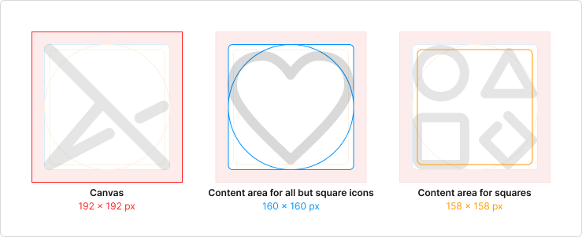
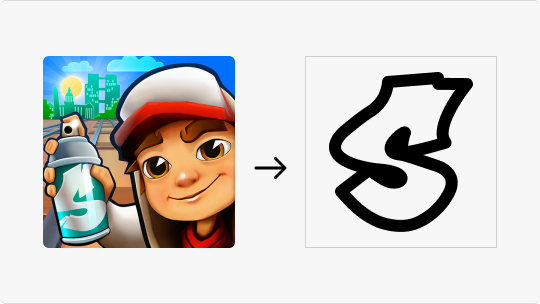
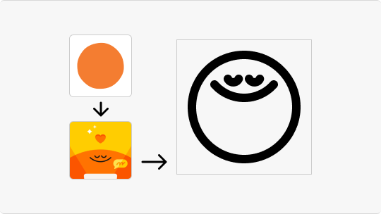
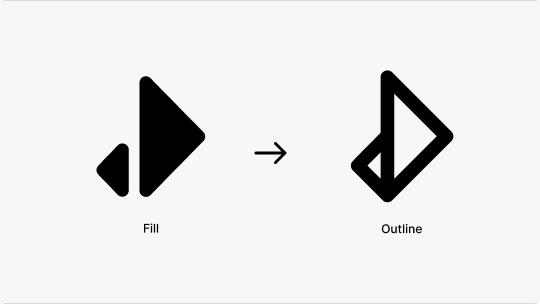
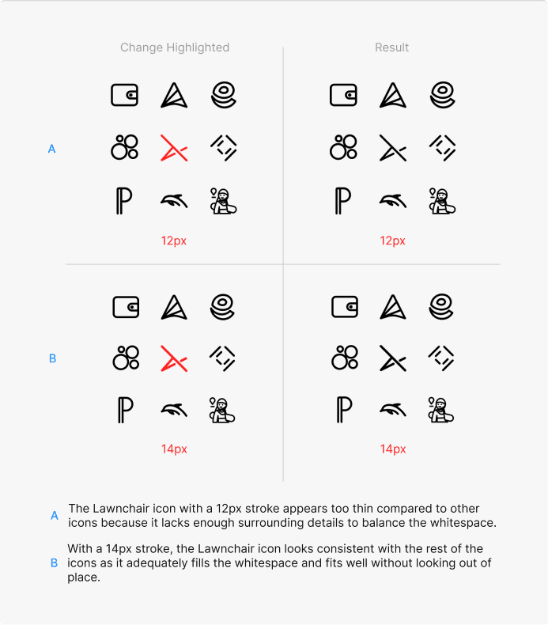

# Lawnicons contributing guide
Welcome to the Lawnicons contributing guide! This file will tell you what you need to know to contribute to Lawnicons.

Before you start, please [fork](https://github.com/LawnchairLauncher/lawnicons/fork) the project and clone it to your machine. Afterwards, you can either contribute icons or code.

## Contributing icons
For beginners, it is faster to create icons [in Figma](https://www.figma.com/), although [Inkscape](https://inkscape.org/) and similar software will do. A file explorer, a text editor, and a terminal window will also be useful.

Need help? [Join Lawnchair on Discord](https://discord.com/invite/3x8qNWxgGZ).

### TL;DR on icon design

> [!NOTE]
> Upload no more than 10 icons at a time.
> For icon samples, see [the Lawnicons Figma repository](https://www.figma.com/community/file/1227718471680779613) made by [Grabstertv](https://github.com/Grabstertv).

The canvas is `192×192px`. The content area for most icons is `160×160px`, meaning the long side of an icon should be `160px`. Square icons should be `154×154px`. No fill, the stroke width is `12px`. All shapes should be black `#000` with rounded ends and joins. Round 90° angles by `6-32px`. Avoid noticable black spots, close distances between strokes, and drastic changes in stroke widths. Simplify details, but don't lose recognizability. Provide original and localized names, so the icons can be found.

To avoid rework, save time and understand the limitations of the guidelines, it is worth reading reviews (e.g., [+8 icons, +1 link, +4 updates](https://github.com/LawnchairLauncher/lawnicons/pull/1865)) and creating 5-10 icons in the first contribution.

### Canvas & Sizes



#### Canvas
The canvas size should be `192×192px` so that there is a safe zone around the icons to control consistency.
#### Content area for all but square
All but square icons must fit the `160×160px` content area size. Be careful with abstract icons: the long side should be `160px`, but the other side can be smaller. Remember to adjust the size of all icons when you change the base stroke thickness (`12px`).
#### Content area for squares
Square icons must fit the `154×154px` content area size. Icons that mostly fit in a square are considered square. If the icon is kinda square and kinda not, choose a size based on density: `154×154px` for dense icons, `160×160px` for the rest. Examples: [GitHub](docs/images/creating-icons-6-sample-icons.png) or [Figma](https://www.figma.com/file/YeHvAvz2g4vqqXGqgGLqRI/%F0%9F%AA%91-Lawnicons-Guidelines?type=design&node-id=307%3A282&mode=design&t=Bf94B5qZCVr9gV0b-1).

### Foundation


#### Color
All shapes must have non-transparent black color `#000000`.
#### Stroke widths
The stroke should be kept at `12px` in most cases. If an icon is too minimal or dense, you'll need other widths: `14px` for the most minimal, and `8px` for the densest. For fine details, you can use `6px`. For more clarification, please refer to [the visual balance section](https://github.com/LawnchairLauncher/lawnicons/blob/develop/CONTRIBUTING.md#maintaining-visual-balance) down below.
#### End caps
All shapes must have rounded caps and joins.
#### Corner radius
Use `6—32px` for 90° angles. It is allowed to leave `0px` radius in cases when the others spoil the shape: for example, when a right angle is formed of short lines.

### Details



When designing icons, it's important to strike a balance with the level of detail. While some icons can be highly detailed, it's acceptable to remove certain details as long as the icon remains recognizable and stays true to its original concept. In some cases, you may need to completely rethink the icon to achieve a minimalist design.

A great example of this is the Subway Surfers icon as seen in the example above. In Lawnicons, it was reimagined by using the graffiti-styled "S" from the game's logo instead of depicting the character, which would have required intricate shapes and varying stroke thicknesses.



In contrary, it's also important to avoid too few details, as they may not be easily recognizable. Take the Headspace icon, for instance, which consists only of a circle. This may pose a problem for users since Lawnicons are not colored, and a simple circle on its own is not easily identifiable. Whenever possible, incorporate additional details that align with the app's design language.

In the Headspace example above, the circles usually have a face representing mood. By adding one of those faces to the circle, you can make the icon more recognizable.

### Maintaining Consistency



All icons must adhere to an outline (not filled) to maintain a consistent theme. However, fill can be used sparingly for small details that require minimal contrast or for elements that cannot be accurately recreated with an outline.

The key is to ensure that any filled elements do not overwhelm the overall icon design and align with the outlined style to create a harmonious and coherent icon set.

### Maintaining Visual Balance



Sharp contrast occurs when there is a drastic change in stroke thickness without a smooth transition. For instance, using a `12px` stroke and suddenly decreasing it to `8px` creates an unbalanced visual effect in the final icon.

To avoid sharp contrast, you can follow either of these two methods:

1. **Uniform Stroke:** Instead of jumping between stroke thicknesses, use the next immediate increment in width. For example, transition from *12px* to *10px*.
2. **Gradual Transition:** Rather than making a large jump, introduce an intermediate thickness. By going from `12px` to `10px` and then to `8px` you create a gradual transition or gradation. This approach helps maintain visual balance in your icon design.

## Naming
To make it easier to find icons, you should keep the original names. Arabic, Chinese or Japanese names need to be supplemented with an English version. If you are adding a link to an existing icon, keep (or complement) the existing app and drawable names.
### App name
Should be the same as in Google Play, F-Droid or the official name. If the name in the source is too long, it's acceptable to remove the second part of the name without loss of recognition.
```
Wrong • Google Play name: "Zoom - One Platform to Connect"
<item component="..." drawable="zoom" name="Zoom - One Platform to Connect" />
```
```
Correct • Edited name: "Zoom"
<item component="..." drawable="zoom" name="Zoom" />
```
Names in different languages are separated via `~~`. If the app name is localized, then the first name should be the one most commonly spoken by the people who will be searching for the icon (if in doubt, in English). 
```
Wrong
<item component="..." drawable="hulu" name="フールー ~~ Hulu" />
```
```
Correct
<item component="..." drawable="hulu" name="Hulu ~~ フールー" />
```
If the first `3` characters of the app name contain letters not from the English alphabet, then it's worth adding the transliterated name.
```
Wrong
<item component="..." drawable="lansforsakringar" name="Länsförsäkringar" />
```
```
Correct
<item component="..." drawable="lansforsakringar" name="Länsförsäkringar ~~ Lansforsakringar" />
```
### Drawable
Should contain letters from the English alphabet and repeat the app name if possible.
```
Wrong
<item component="..." drawable="itaú" name="Itaú" />
```
```
Correct
<item component=..." drawable="itau" name="Itaú" />
```
If the app name starts with a digit, then the drawable should start with `_`.
```
Wrong
<item component="..." drawable="ninegag" name="9GAG" />
```
```
Correct
<item component="..." drawable="_9gag" name="9GAG" />
```

## Adding an icon to Lawnicons
### Prerequisites
* A fork of the Lawnicons repository.
* Your icon in the SVG format, adhering to [the above guidelines](#contributing-icons). The filename must use snake case (e.g. `spck_editor.svg`).
* The package and activity name of the app.

### Via `icontool.py`
Please check [the icon tool guide](/docs/icontool_guide.md) for more information.

### Via manual process
1. Add the ready SVG to the `svgs` directory. If you want to add a link to an existing SVG, you will need its name.

2. Add a new line to `app/assets/appfilter.xml` (in alphabetical order, by the `name` attribute), and map the new icon to a package name and app's activity.

    **Example**
    - the app name: `Spck Editor`;
    - the svg (drawable) name: `spck_editor`;
    - the package and activity of the app: `io.spck/io.spck.EditorActivity`.
  
    **The new line**
    ```xml
    <item component="ComponentInfo{io.spck/io.spck.EditorActivity}" drawable="spck_editor" name="Spck Editor" />
    ```

    **General template**
    ```xml
    <item component="ComponentInfo{[PACKAGE_NAME]/[APP_ACIVITY_NAME]}" drawable="[DRAWABLE NAME]" name="[APP NAME]" />
    ```

4. Done! You're ready to open a pull request. Please set `develop` as the base branch.

## Finding the package and activity name of an app
### Using Lawnicons
1. Install and open [Lawnicons 2.13+](https://github.com/LawnchairLauncher/lawnicons/releases).
2. Tap "Request icons". After that, our request form will open with a response ready to be submit.
3. Submit the response. You can copy the submitted activities [from our table](https://docs.google.com/spreadsheets/d/1AXc9EDXA6udZeGROtB5nuABjM33VluGY_V24tIzHaKc/edit?resourcekey=&gid=1039095616#gid=1039095616) (sorted by date).

### Using `adb`
1. Connect your Android device or emulator to your laptop/desktop PC that has `adb` installed (see [this tutorial](https://www.xda-developers.com/install-adb-windows-macos-linux/) for more information) and open the app whose details you want to inspect, e.g. Telegram.
2. Open a new Command Prompt or Terminal window and input `adb devices`.
3. Finally, type the below-given command to get the information about the currently open application.

  **For Mac or Linux**:

  ```console
  adb shell dumpsys window | grep 'mCurrentFocus'
  ```

  **For Windows**:

  ```console
  adb shell dumpsys window | findstr "mCurrentFocus"
  ```
  

  The part before the `/` character in the above image, i.e. `org.telegram.messenger`, is the package name (`[PACKAGE_NAME]`). The part after it, i.e. `org.telegram.messenger.DefaultIcon`, is the activity name (`[APP_ACIVITY_NAME]`).

### Using 3rd-party apps

#### IconRequest app
1. Download IconRequest: [Google Play](https://play.google.com/store/apps/details?id=de.kaiserdragon.iconrequest) • [GitHub](https://github.com/Kaiserdragon2/IconRequest/releases).
2. Launch IconRequest and tap one of the options:
- UPDATE EXISTING — to copy packages with activities.
- REQUEST NEW — to save icon images and packages with activities. This option is better if you are creating icons.
3. Use the app toolbar to select the apps for which youʼd like to request or make icons.
4. Copy, save or share.

#### Icon Pusher app
1. Download the [Icon Pusher app](https://play.google.com/store/apps/details?id=dev.southpaw.iconpusher&hl=en&gl=US).
2. Launch the app.
3. Select the icon(s) you want to upload or select all by pressing the square in the top right. Then press "Send".
4. View the packages with the activities for each app on the [Icon Pusher website](https://iconpusher.com/). Please make sure the `drawable="[DRAWABLE NAME]"` matches the icon SVG file name.

## Contributing code
While adding icons is the main focus for most contributors, code-related contributions are welcome.

To build Lawnicons, select the `appDebug` build variant.

Here are a few contribution tips:
- [The `app` module](https://github.com/LawnchairLauncher/lawnicons/tree/develop/app) contains most of Lawnicons' core code, while [the `svg-processor` module](https://github.com/LawnchairLauncher/lawnicons/tree/develop/svg-processor) contains the code that converts the SVGs inside the `svgs` folder into Android Drawables. Generally, the `app` module is where you should make most of your contributions.
- You can use either Java or, preferably, Kotlin.
- Make sure your code is logical and well formatted. If using Kotlin, see ["Coding conventions"](https://kotlinlang.org/docs/coding-conventions.html) in the Kotlin documentation.
- Set `develop` as the base branch for pull requests.
- Significant changes to the UI should be discussed on our [Lawnchair's Telegram group chat](https://t.me/lawnchairci). Generally, we want to keep things clean and simple.
