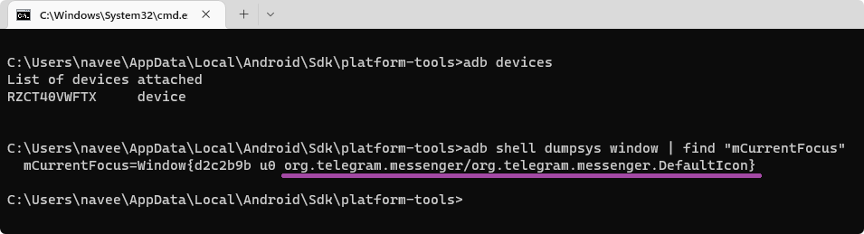

# Lawnicons contributing guide
Welcome to the Lawnicons contributing guide!

When working on Lawnicons, we adhere to the DIY principle. Let's try to minimize time losses. Please ask questions about the guide in our Discord. If you find errors, create an issue.

[Our Discord](https://discord.com/invite/3x8qNWxgGZ)

## Contributing code
While adding icons is the main focus for most contributors, code-related contributions are welcome.

To build Lawnicons, select the `appDebug` build variant.

Here are a few contribution tips:
- [The `app` module](https://github.com/LawnchairLauncher/lawnicons/tree/develop/app) contains most of Lawnicons' core code, while [the `svg-processor` module](https://github.com/LawnchairLauncher/lawnicons/tree/develop/svg-processor) contains the code that converts the SVGs inside the `svgs` folder into Android Drawables. Generally, the `app` module is where you should make most of your contributions.
- You can use either Java or, preferably, Kotlin.
- Make sure your code is logical and well formatted. If using Kotlin, see ["Coding conventions"](https://kotlinlang.org/docs/coding-conventions.html) in the Kotlin documentation.
- Set `develop` as the base branch for pull requests.
- Significant changes to the UI should be discussed on our [Lawnchair's Telegram group chat](https://t.me/lawnchairci). Generally, we want to keep things clean and simple.

## Contributing icons

### Icon contribution approach

The main goal is to create a high-quality icon in the style of Lawnicons. The icon should make it clear which application will open. Sometimes, to achieve this goal, you need to create an icon from scratch. You shouldn't copy an original icon, neglecting the quality.

We recommend:
- Carefully study the Lawnicons design guidelines.
- See how other contributors have made pull requests (PRs).
- Practice on easy-to-make icons to understand the whole process.
- Make no more than 5 icons at a time, as long as your PRs require rework.

[Lawnicons design guidelines](https://github.com/LawnchairLauncher/lawnicons/blob/develop/CONTRIBUTING.md) • [Merged PRs](https://github.com/LawnchairLauncher/lawnicons/pulls?q=is%3Apr+is%3Amerged) • [Easy-to-make icons
](https://docs.google.com/spreadsheets/d/1AXc9EDXA6udZeGROtB5nuABjM33VluGY_V24tIzHaKc/edit?usp=sharing)

### Tools

#### Vector graphics editor

To create icons, you need a vector graphics editor, which allows you to save icons in SVG format. Mobile vector editors won't work. We recommend Figma because it has easier quality control. If you want to save optimized SVGs in Figma, you can use Advanced SVG Export.

[Figma](https://www.figma.com/) • [Advanced SVG Export](https://www.figma.com/community/plugin/782713260363070260) 

#### GitHub Desktop

You can use it to create a local copy of your repository on GitHub and upload all the changes. Before getting into your repository, the changes must appear in your local copy.

[GitHub Desktop](https://github.com/apps/desktop)

#### Component search tool
You can use it to find application components. Lawnicons allows you to find components for missing icons. Icon Request and Icon Pusher are better suited for any icons. If you fulfill icon requests from our table, all the components are there.

[How to find application components](https://github.com/LawnchairLauncher/lawnicons/blob/develop/CONTRIBUTING.md#finding-the-package-and-activity-name-of-an-app)

#### Other tools
**File explorer**. It will help you copy icons to a local copy of your repository.

**Text editor**. It will help you to link icons and their components in `appfilter.xml`. This is how icon packs work.

**Terminal (command line)**. It will add convenience if you regularly contribute dozens of icons or want to avoid an end-to-end history of changes in your PRs.

### Lawnicons design guidelines

#### Canvas & Sizes


**Canvas**  

The canvas size should be `192×192px` so that there is a safe zone around the icons to control consistency.

**Content area for all but square**  

All but square icons must fit the `160×160px` content area size. Be careful with abstract icons: the long side should be `160px`, but the other side can be smaller. Remember to adjust the size of all icons when you change the base stroke thickness (`12px`).

**Content area for squares**  

Square icons must fit the `154×154px` content area size. Icons that mostly fit in a square are considered square. If the icon is kinda square and kinda not, choose a size based on density: `154×154px` for dense icons, `160×160px` for the rest. Examples: [GitHub](docs/images/creating-icons-6-sample-icons.png) or [Figma](https://www.figma.com/file/YeHvAvz2g4vqqXGqgGLqRI/%F0%9F%AA%91-Lawnicons-Guidelines?type=design&node-id=307%3A282&mode=design&t=Bf94B5qZCVr9gV0b-1).

#### Foundation


**Color**  

All shapes must have non-transparent black color `#000000`.

**Stroke widths**  

The stroke should be kept at `12px` in most cases. If an icon is too minimal or dense, you'll need other widths: `14px` for the most minimal, and `8px` for the densest. For fine details, you can use `6px`. For more clarification, please refer to [the visual balance section](https://github.com/LawnchairLauncher/lawnicons/blob/develop/CONTRIBUTING.md#maintaining-visual-balance) down below.

**End caps**  

All shapes must have rounded caps and joins.

**Corner radius**  

Use `6—32px` for 90° angles. It is allowed to leave `0px` radius in cases when the others spoil the shape: for example, when a right angle is formed of short lines.

#### Details


When designing icons, it's important to strike a balance with the level of detail. While some icons can be highly detailed, it's acceptable to remove certain details as long as the icon remains recognizable and stays true to its original concept. In some cases, you may need to completely rethink the icon to achieve a minimalist design.

A great example of this is the Subway Surfers icon as seen in the example above. In Lawnicons, it was reimagined by using the graffiti-styled "S" from the game's logo instead of depicting the character, which would have required intricate shapes and varying stroke thicknesses.


In contrary, it's also important to avoid too few details, as they may not be easily recognizable. Take the Headspace icon, for instance, which consists only of a circle. This may pose a problem for users since Lawnicons are not colored, and a simple circle on its own is not easily identifiable. Whenever possible, incorporate additional details that align with the app's design language.

In the Headspace example above, the circles usually have a face representing mood. By adding one of those faces to the circle, you can make the icon more recognizable.

#### Maintaining Consistency


All icons must adhere to an outline (not filled) to maintain a consistent theme. However, fill can be used sparingly for small details that require minimal contrast or for elements that cannot be accurately recreated with an outline.

The key is to ensure that any filled elements do not overwhelm the overall icon design and align with the outlined style to create a harmonious and coherent icon set.

#### Maintaining Visual Balance


Sharp contrast occurs when there is a drastic change in stroke thickness without a smooth transition. For instance, using a `12px` stroke and suddenly decreasing it to `8px` creates an unbalanced visual effect in the final icon.

To avoid sharp contrast, you can follow either of these two methods:

1. **Uniform Stroke:** Instead of jumping between stroke thicknesses, use the next immediate increment in width. For example, transition from *12px* to *10px*.
2. **Gradual Transition:** Rather than making a large jump, introduce an intermediate thickness. By going from `12px` to `10px` and then to `8px` you create a gradual transition or gradation. This approach helps maintain visual balance in your icon design.

### Naming
To make it easier to find icons, you should keep the original names. Arabic, Chinese or Japanese names need to be supplemented with an English version. If you are adding a link to an existing icon, keep (or complement) the existing app and drawable names.

**App name**  

Should be the same as in Google Play, F-Droid or the official name. If the name in the source is too long, it's acceptable to remove the second part of the name without loss of recognition.
```
Wrong • Google Play name: "Zoom - One Platform to Connect"
<item component="..." drawable="zoom" name="Zoom - One Platform to Connect" />
```
```
Correct • Edited name: "Zoom"
<item component="..." drawable="zoom" name="Zoom" />
```
Names in different languages are separated via `~~`. If the app name is localized, then the first name should be the one most commonly spoken by the people who will be searching for the icon (if in doubt, in English). 
```
Wrong
<item component="..." drawable="hulu" name="フールー ~~ Hulu" />
```
```
Correct
<item component="..." drawable="hulu" name="Hulu ~~ フールー" />
```
If the first `3` characters of the app name contain letters not from the English alphabet, then it's worth adding the transliterated name.
```
Wrong
<item component="..." drawable="lansforsakringar" name="Länsförsäkringar" />
```
```
Correct
<item component="..." drawable="lansforsakringar" name="Länsförsäkringar ~~ Lansforsakringar" />
```

**Drawable (icon) name**  

Should contain letters from the English alphabet and repeat the app name if possible.
```
Wrong
<item component="..." drawable="itaú" name="Itaú" />
```
```
Correct
<item component=..." drawable="itau" name="Itaú" />
```
If the app name starts with a digit, then the drawable should start with `_`.
```
Wrong
<item component="..." drawable="ninegag" name="9GAG" />
```
```
Correct
<item component="..." drawable="_9gag" name="9GAG" />
```

### How to find application components

An application component is a record consisting of a package and an activity, separated by /. Components allow you to link icons and applications. 

Sample (Lawnicons)  
package: `app.lawnchair.lawnicons`  
activity: `app.lawnchair.lawnicons.MainActivity`  
component: `app.lawnchair.lawnicons/app.lawnchair.lawnicons.MainActivity`  

**Lawnicons**  

This method is suitable if you are interested in installed applications that don't have icons.
1. Install and open Lawnicons.
2. Long press our logo.
3. Swipe down.
4. Copy missing components to clipboard.
5. Save it wherever it's convenient.

[Download Lawnicons](https://github.com/x9136/lawnicons#download)

**Icon Request**  

1. Download and launch `Icon Request`.
2. Tap one of the options:
- UPDATE EXISTING — to copy packages with activities.
- REQUEST NEW — to save icon images and packages with activities. This option is better if you are creating icons.
3. Use the app toolbar to select the apps for which youʼd like to request or make icons.
4. Copy, save or share.

[Google Play](https://play.google.com/store/apps/details?id=de.kaiserdragon.iconrequest) • [GitHub](https://github.com/Kaiserdragon2/IconRequest/releases)

**Icon Pusher**  

1. Download and launch `Icon Pusher`.
2. Select the icons you want to upload or select all by pressing the square in the top right.
3. Submit the selected apps.
4. View the submitted components on the Icon Pusher website.

[Google Play](https://play.google.com/store/apps/details?id=dev.southpaw.iconpusher) • [Website](https://iconpusher.com/)

**Android Debug Bridge (adb)**  

1. Connect your Android device or emulator to your laptop/desktop PC that has `adb` installed (see [this tutorial](https://www.xda-developers.com/install-adb-windows-macos-linux/) for more information) and open the app whose details you want to inspect, e.g. Telegram.
2. Open a new Command Prompt or Terminal window and input `adb devices`.
3. Finally, type the below-given command to get the information about the currently open application.

  **Mac or Linux**

  ```console
  adb shell dumpsys window | grep 'mCurrentFocus'
  ```

  **Windows**

  ```console
  adb shell dumpsys window | findstr "mCurrentFocus"
  ```
  

  The part before the `/` character in the above image, i.e. `org.telegram.messenger`, is the package name (`[PACKAGE_NAME]`). The part after it, i.e. `org.telegram.messenger.DefaultIcon`, is the activity name (`[APP_ACIVITY_NAME]`).

### Adding an icon to Lawnicons

You need to link your SVGs and application components correctly, create a PR to our repository through your fork, and wait for it to be reviewed.

**Manual process**  

Let's imagine that you have an icon in SVG format, a component and an application name.

icon: `lawnicons.svg`  
application name: `Lawnicons`  
component: `app.lawnchair.lawnicons/app.lawnchair.lawnicons.MainActivity`

1. Fork our repository so that you have your own copy to work with. Your repository will be a bridge between our repository and your contribution.
2. Clone your repository in GitHub Desktop and open it with a file explorer.
3. Copy `lawnicons.svg` to `svgs/` folder. Avoid name conflicts. If you want to link an application component to an existing icon, you will need its name.
4. Open `app/assets/appfilter.xml` and evaluate how the lines are designed. Add a new line based on your information, take into account the alphabetical sorting by the application name.

```
<item component="ComponentInfo{app.lawnchair.lawnicons/app.lawnchair.lawnicons.MainActivity}" drawable="lawnicons" name="Lawnicons" />
```

5. Save all your changes and push it to your repository via GitHub Desktop.
6. Open your repository in a web browser and open a PR: `Contribute → Open pull request`.
7. Describe your PR according to our templates and create it.
8. Make sure that the build went without errors. Wait for a review or do a self-review.
9. We will merge your PR, fix the little things, or leave a comment asking you to rework.

To link an application component to an existing icon, you need to go through the same process. The main thing is to consider the identity of the icons. For example, Just Eat and Menulog have the identical icons.

Please keep your repository up to date, otherwise you may drag the commit history through all your PRs. There are 2 main ways to do this:
1. Open `Terminal` on a local copy of your repository via GitHub Desktop. Run `git reset --hard upstream/develop`. Overwrite your repository with your local copy via GitHub Desktop: `Force push origin`.
2. Or delete your repository and start the contribution process from scratch.

**Via icontool.py**  

This tool will help you if you regularly create dozens of icons and are familiar with the command line.

[icontool.py guide](/docs/icontool_guide.md)
