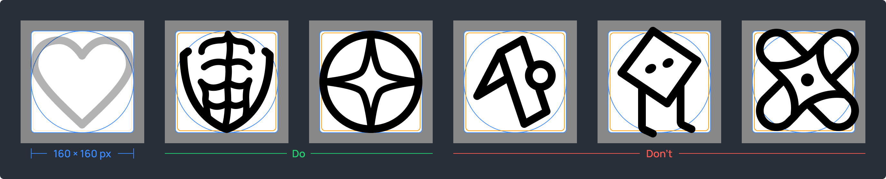
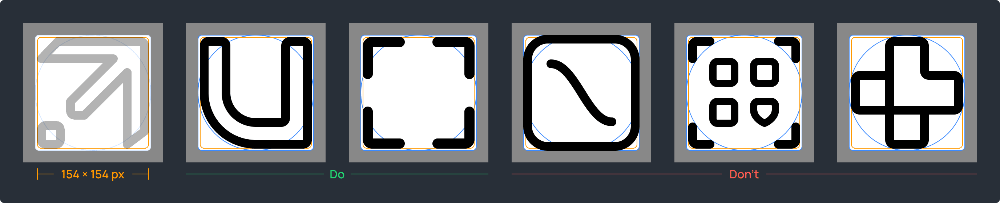
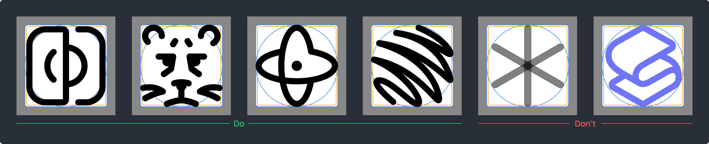
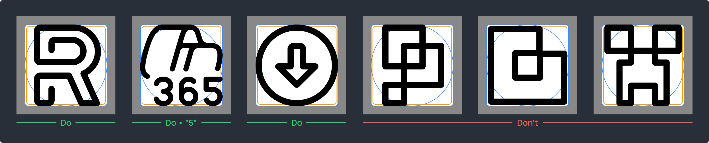
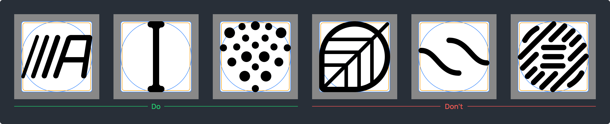

# Lawnicons contributing guide
Welcome to the Lawnicons contributing guide!

When working on Lawnicons, we adhere to the DIY principle. Let's try to minimize time losses. Please ask questions about the guide in our Discord. If you find errors in the guide, create an issue.

[Our Discord](https://discord.com/invite/3x8qNWxgGZ)

## Contributing code
Code-related contributions are welcome. The main tasks are to maintain Lawnicons and interaction with launchers, fix bugs, add new features and automate organizational processes. Please see our issues for more details.

To build Lawnicons, select the `appDebug` build variant.

Tips:
- Set `develop` as the base branch for pull requests.
- You can use either Java or, preferably, Kotlin.
- Make sure your code is logical and well formatted. If using Kotlin, see "Coding conventions" in the Kotlin documentation.
- The `app` module contains most of Lawnicons' core code, while the `svg-processor` module contains the code that converts the SVGs inside the `svgs` folder into Android Drawables. Generally, the `app` module is where you should make most of your contributions.
- Significant changes to the UI should be discussed on our Lawnchair's Telegram group chat. Generally, we want to keep things clean and simple.

[Coding conventions](https://kotlinlang.org/docs/coding-conventions.html) • [App module](https://github.com/LawnchairLauncher/lawnicons/tree/develop/app) • [SVG-processor module](https://github.com/LawnchairLauncher/lawnicons/tree/develop/svg-processor) • [Lawnchair's Telegram](https://t.me/lawnchairci)

## Contributing icons

### Icon contribution approach

The main goal is to create high-quality icons in the style of Lawnicons. The icons should make it clear which application will open. Sometimes, to achieve this goal, you need to create an icon from scratch. Don't copy original icons, neglecting the quality. Avoid compromise as much as possible.

Tips:
- Carefully study the Lawnicons design guidelines.
- See how other contributors have made pull requests (PRs).
- Practice on easy-to-make icons to understand the whole process.
- Make no more than 5 icons at a time, as long as your PRs require rework.

[Lawnicons design guidelines](https://github.com/LawnchairLauncher/lawnicons/blob/develop/CONTRIBUTING.md#lawnicons-design-guidelines) • [Merged PRs](https://github.com/LawnchairLauncher/lawnicons/pulls?q=is%3Apr+is%3Amerged+label%3Aicons) • [Easy-to-make icons
](https://docs.google.com/spreadsheets/d/1AXc9EDXA6udZeGROtB5nuABjM33VluGY_V24tIzHaKc/edit?usp=sharing)

### Tools

#### Vector graphics editor

To create icons, you need a vector graphics editor, which allows you to save icons in SVG format. Mobile vector editors won't work. We recommend Figma because it has easier quality control. You can use Advanced SVG Export to save optimized SVGs in Figma.

[Figma](https://www.figma.com/) • [Advanced SVG Export](https://www.figma.com/community/plugin/782713260363070260) 

#### GitHub Desktop

You can use it to create a local copy of your repository on GitHub and upload all the changes. Before getting into your repository, the changes must appear in your local copy.

[GitHub Desktop](https://github.com/apps/desktop)

#### Component search tool

You can use it to find application components. Lawnicons allows you to find components for missing icons. Icon Request and Icon Pusher are better suited for any icons. If you fulfill icon requests from our table, all the components are there.

[How to find application components](https://github.com/LawnchairLauncher/lawnicons/blob/develop/CONTRIBUTING.md#finding-the-package-and-activity-name-of-an-app)

#### Other tools
**File explorer**. It will help you copy icons to a local copy of your repository.

**Text editor**. It will help you to link icons and application components in `appfilter.xml`. This is how icon packs work.

**Terminal (command line)**. It will add convenience if you regularly contribute dozens of icons or want to avoid an end-to-end history of changes in your PRs.

## Lawnicons design guidelines

The consistency of Lawnicons is based on fundamentals and quality. Please read it carefully to avoid any rework. In case of unclear wording, write to us in Discord.

The people who laid the foundations: [GrabsterTV](https://github.com/Grabstertv) and [Chefski](https://github.com/Chefski)

[View in Figma](https://www.figma.com/design/YeHvAvz2g4vqqXGqgGLqRI/%F0%9F%AA%91-Lawnicons-Guidelines?node-id=814-1114&t=fHuLvXCiz0jsFHYB-1) • [Our Discord](https://discord.com/invite/3x8qNWxgGZ)

### Fundamentals

**Canvas**  


`192 × 192 px`. Use the correct canvas size to create a safe zone around icons.  

**Abstract icons**  



`160 × 160 px`. The long side of an abstract icon should be `160 px`, but the other side could be smaller. In the case of curved boundaries, the margin of error is `<0.1 px`.  

**Square icons**  



`154 × 154 px`. These are icons with `50%` or more of the edges running along the square.  

**Color**  



All lines must be non-transparent black color: `#000000`.  

**Stroke weights**  


Core weight: `12 px`  
Allowable weights: `14 px`, `10 px`, `8 px`  
Fine details: `6 px` 

The stroke weight should be kept at `12 px` in most cases. If an icon is too minimal or dense, you'll need other weights: `14 px` for the most minimal, and `8 px` for the densest. For fine details, you can use `6 px`.

No margin of error. Don’t use a fill. Remember to adjust the size of icons when you change the stroke weights.  

**Start and end caps, joints**  


Start and end caps, as well as joints, should be rounded.  

**Corner radius**  



Use `6–32 px` for `90°` angles. Refer to the original icon to select a value from the range. It's allowed to leave a `0 px` radius in cases when the others spoil the shape: for instance, when `90°` angles are formed of short lines.

### Quality

**Consistency**  


All icons should be outlined. If necessary, you can use small shapes that mimic a fill but are made with a stroke. For instance, `8 × 8 px` ellipses with a `8 px` stroke. Ensure that any elements don’t overwhelm the overall icon design and align with the outlined style.  

**Visual balance**  



Sharp contrast occurs when there is a drastic change in a stroke weight without a smooth transition. For instance, using a `12 px` stroke and suddenly decreasing it to `8 px` creates an unbalanced visual effect.

Tips:
- Avoid large differences between adjacent lines.
- Use a gradual transition if it makes sense. For instance, `12 px` → `10 px` → `8 px`.
- Apply a `14 px` stroke for minimalistic icons.
- Reduce the main stroke weight depending on an icon density.  

**Black spots**  


Avoid black spots as much as possible.

Tips:
- Trim lines.
- Reduce stroke weights.
- Simplify or redraw.  

**Excessive density**  


Keep at least `8 px` between lines. Ideally, at least `12 px`.

Tips:
- Move lines further apart.
- Combine parallel lines into one.
- Trim or extend lines.
- Reduce stroke weights.
- Enlarge original icons to make the main features easier to draw.
- Simplify or redraw.

**Visual center alignment**  


When icons are geometrically aligned, some of them look off-center because of their shape. The visual center is where your icon looks and feels centered. Align icons to the visual center as much as possible within the icon content area.  

**Text icons**  


Text longer than `3` letters usually don’t fit the Lawnicons style. Brands and applications with text icons often need to be studied in order to create a recognizable Lawnicons-style icon.

If you want to keep only a text, then it should be of high quality and occupy at least `¹⁄₃` of the icon content area. This is rare.

**Complex icons**  


Many complex icons can be made in the Lawnicons style, taking into account the original, so it's worth giving it a try first. When it’s clear that the original icon can’t be conveyed in the Lawnicons style, you need to study the visual part of an application or a game.

Whatever you come to, the result should be at least logical and high-quality.

Sources for creating a recognizable icon:
- Branding guidelines.
- UI or gameplay.
- Website’s favicons.
- In-app icons.
- Essence of an application or a game.
- Combination of recognizable features and your own ideas.  

**Minimalistic icons**  


Such icons may relate to multiple applications. Add distinctive features to them when it makes sense.  

### Naming
To make it easier to find icons, you should keep the original names. Arabic, Chinese or Japanese names need to be supplemented with an English version. If you are adding a link to an existing icon, keep (or complement) the existing app and drawable names.

**App name**  

Should be the same as in Google Play, F-Droid or the official name. If the name in the source is too long, it's acceptable to remove the second part of the name without loss of recognition.
```
Wrong • Google Play name: "Zoom - One Platform to Connect"
<item component="..." drawable="zoom" name="Zoom - One Platform to Connect" />
```
```
Correct • Edited name: "Zoom"
<item component="..." drawable="zoom" name="Zoom" />
```
Names in different languages are separated via `~~`. If the app name is localized, then the first name should be the one most commonly spoken by the people who will be searching for the icon (if in doubt, in English). 
```
Wrong
<item component="..." drawable="hulu" name="フールー ~~ Hulu" />
```
```
Correct
<item component="..." drawable="hulu" name="Hulu ~~ フールー" />
```
If the first `3` characters of the app name contain letters not from the English alphabet, then it's worth adding the transliterated name.
```
Wrong
<item component="..." drawable="lansforsakringar" name="Länsförsäkringar" />
```
```
Correct
<item component="..." drawable="lansforsakringar" name="Länsförsäkringar ~~ Lansforsakringar" />
```

**Drawable (icon) name**  

Should contain letters from the English alphabet and repeat the app name if possible.
```
Wrong
<item component="..." drawable="itaú" name="Itaú" />
```
```
Correct
<item component=..." drawable="itau" name="Itaú" />
```
If the app name starts with a digit, then the drawable should start with `_`.
```
Wrong
<item component="..." drawable="ninegag" name="9GAG" />
```
```
Correct
<item component="..." drawable="_9gag" name="9GAG" />
```

## How to find application components

An application component is a record consisting of a package and an activity, separated by `/`. Application omponents allow you to link icons and applications. 

Sample (Lawnicons)  
Package: `app.lawnchair.lawnicons`  
Activity: `app.lawnchair.lawnicons.MainActivity`  
Component: `app.lawnchair.lawnicons/app.lawnchair.lawnicons.MainActivity`  

**Lawnicons**  

This method is suitable if you are interested in installed applications that are not supported in Lawnicons.
1. Install and open Lawnicons.
2. Long press our logo.
3. Swipe down.
4. Copy missing components to clipboard.
5. Save it wherever it's convenient.

[Download Lawnicons](https://github.com/LawnchairLauncher/lawnicons#download)

**Icon Request**  

1. Download and launch Icon Request.
2. Tap one of the options:
- UPDATE EXISTING — to copy application components.
- REQUEST NEW — to save icon images and application components. This option is better if you are creating icons.
3. Use the Icon Request toolbar to select apps.
4. Copy, save or share.

[Google Play](https://play.google.com/store/apps/details?id=de.kaiserdragon.iconrequest) • [GitHub](https://github.com/Kaiserdragon2/IconRequest/releases)

**Icon Pusher**  

1. Download and launch Icon Pusher.
2. Select the icons you want to upload or select all by pressing the square in the top right.
3. Submit the selected apps.
4. View the submitted components on the Icon Pusher website.

[Google Play](https://play.google.com/store/apps/details?id=dev.southpaw.iconpusher) • [Website](https://iconpusher.com/)

**Android Debug Bridge (adb)**  

1. Connect your Android device or emulator to your laptop/desktop PC that has `adb` installed (see [this tutorial](https://www.xda-developers.com/install-adb-windows-macos-linux/) for more information).
2. Open the app whose details you want to inspect (e.g. Telegram).
3. Open a new Command Prompt or Terminal window and input `adb devices`.
4. Finally, type the below-given command to get the information about the currently open application.

  **Mac or Linux**

  ```console
  adb shell dumpsys window | grep 'mCurrentFocus'
  ```

  **Windows**

  ```console
  adb shell dumpsys window | findstr "mCurrentFocus"
  ```
  

## Adding an icon to Lawnicons

You need to link your SVGs and application components correctly, create a PR to our repository through your fork, and wait for it to be reviewed.

**Manual process**  

Let's imagine that you have an icon in SVG format, an application name and a component.

Icon: `lawnicons.svg`  
Application name: `Lawnicons`  
Component: `app.lawnchair.lawnicons/app.lawnchair.lawnicons.MainActivity`

1. Fork our repository so that you have your own copy to work with. Your repository will be a bridge between our repository and your contribution.
2. Clone your repository in GitHub Desktop and open it with a file explorer.
3. Copy `lawnicons.svg` to `svgs/` folder. Avoid name conflicts. If you want to link an application component to an existing icon, you will need its name.
4. Open `app/assets/appfilter.xml` and evaluate how the lines are designed. Add a new line based on your information, take into account the alphabetical sorting by the application name.

```
<item component="ComponentInfo{app.lawnchair.lawnicons/app.lawnchair.lawnicons.MainActivity}" drawable="lawnicons" name="Lawnicons" />
```

5. Save all your changes and push it to your repository via GitHub Desktop.
6. Open your repository in a web browser and open a PR: `Contribute → Open pull request`.
7. Describe your PR according to our templates and create it.
8. Make sure that the build went without errors. Wait for a review or do a self-review.
9. We will merge your PR, fix the little things, or leave a comment asking you to rework.

To link an application component to an existing icon, you need to go through the same process. The main thing is to consider the identity of the icons. For instance, Just Eat and Menulog have the identical icons.

Please keep your repository up to date, otherwise you may drag a commit history through all your PRs. There are 2 main ways to do this:
1. Open `Terminal` on the local copy of your repository via GitHub Desktop. Run `git reset --hard upstream/develop`. Overwrite your repository with your local copy via GitHub Desktop: `Force push origin`.
2. Or delete your repository and start the contribution process from scratch.

**Via icontool.py**  

This tool will help you if you regularly create dozens of icons and are familiar with the command line.

[icontool.py guide](/docs/icontool_guide.md)
