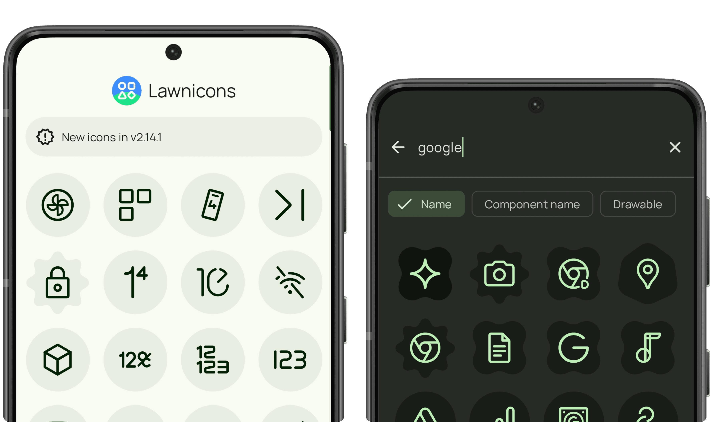
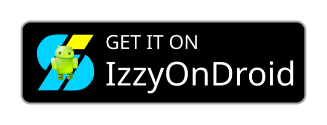

<h1 align="center" style="margin-top: 0px;">Lawnicons</h1>

    
  
  
  
      

 

Lawnicons is an icon pack developed by the Lawnchair team and supported by our community. Originally an addon for Lawnchair 12 Alpha 5 and above to implement themed icons, it can now be used on many launchers.

Try Lawnicons on the latest version of Lawnchair. You can enable themed icons by going to `Home Settings → General → Icon Style` and choosing the desired option.

[Try Lawnchair](https://play.google.com/store/apps/details?id=app.lawnchair.play)

## Download

  
  
  
  

Lawnicons on the Play Store will install as a different app from other sources.

**Pre-release version with recent updates**

[nightly.link](https://nightly.link/LawnchairLauncher/lawnicons/workflows/build_debug_apk/develop/Debug%20APK) • [Obtainium](https://apps.obtainium.imranr.dev/redirect?r=obtainium://app/%7B%22id%22%3A%22app.lawnchair.lawnicons%22%2C%22url%22%3A%22https%3A%2F%2Fgithub.com%2FLawnchairLauncher%2Flawnicons%22%2C%22author%22%3A%22LawnchairLauncher%22%2C%22name%22%3A%22Lawnicons%22%2C%22preferredApkIndex%22%3A0%2C%22additionalSettings%22%3A%22%7B%5C%22includePrereleases%5C%22%3Atrue%2C%5C%22fallbackToOlderReleases%5C%22%3Atrue%2C%5C%22filterReleaseTitlesByRegEx%5C%22%3A%5C%22Lawnicons%20Nightly%5C%22%2C%5C%22filterReleaseNotesByRegEx%5C%22%3A%5C%22%5C%22%2C%5C%22verifyLatestTag%5C%22%3Afalse%2C%5C%22dontSortReleasesList%5C%22%3Afalse%2C%5C%22useLatestAssetDateAsReleaseDate%5C%22%3Afalse%2C%5C%22trackOnly%5C%22%3Afalse%2C%5C%22versionExtractionRegEx%5C%22%3A%5C%22%5C%22%2C%5C%22matchGroupToUse%5C%22%3A%5C%22%5C%22%2C%5C%22versionDetection%5C%22%3Afalse%2C%5C%22releaseDateAsVersion%5C%22%3Atrue%2C%5C%22useVersionCodeAsOSVersion%5C%22%3Afalse%2C%5C%22apkFilterRegEx%5C%22%3A%5C%22%5C%22%2C%5C%22invertAPKFilter%5C%22%3Afalse%2C%5C%22autoApkFilterByArch%5C%22%3Atrue%2C%5C%22appName%5C%22%3A%5C%22Lawnicons%20Nightly%5C%22%2C%5C%22shizukuPretendToBeGooglePlay%5C%22%3Afalse%2C%5C%22allowInsecure%5C%22%3Afalse%2C%5C%22exemptFromBackgroundUpdates%5C%22%3Afalse%2C%5C%22skipUpdateNotifications%5C%22%3Afalse%2C%5C%22about%5C%22%3A%5C%22%5C%22%7D%22%2C%22overrideSource%22%3Anull%7D) • [GitHub](https://github.com/LawnchairLauncher/lawnicons/releases/tag/nightly)

## Supporting

> [!IMPORTANT]
> Sustain Lawnicons by backing the Lawnchair team.

[Support Lawnchair team](https://opencollective.com/lawnchair)

## Contributing

    
    
    

 

### Icons
Following the design guidelines is essensial. You can add the missing icons if they are of high quality. Add no more than 5 icons at a time to avoid unnecessary rework. To help with requests, please prioritize popular, widely-installed (5M+) apps.

> [!NOTE]
> Each icon approved and merged on the first try fulfills [a simple community request](https://lawnicons-requests.vercel.app/?filters=easy).
 
### Development
You can help with issues. Please refer to our guidelines.

### Requests

`Open Lawnicons → Tap "Request icons" → Select and request icons`

A 1-week icon request period opens at every thousand-icon milestone. Requests inform demand but don't drive contributions. Our community creates icons according to their own priorities.
