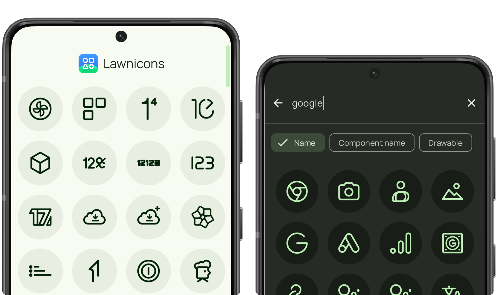
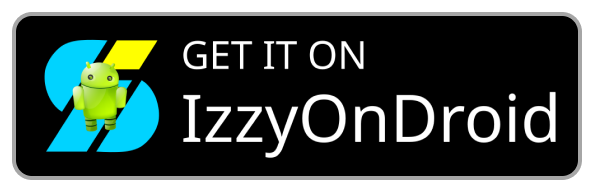

    
  
  
  
      

 

Lawnicons is an icon pack developed by the Lawnchair team and supported by our community. Originally an addon for Lawnchair 12 Alpha 5 and above to implement themed icons, it can now be used on many launchers.

Lawnicons is best used [on the latest version of Lawnchair](https://play.google.com/store/apps/details?id=app.lawnchair.play). You can enable themed icons on Lawnchair by going to `Home Settings → General → Icon Style` and choosing the desired option.

## Download

  
  
  
  

Lawnicons on the Play Store will install as a different app from other sources.

**Development builds:** [nightly.link](https://nightly.link/LawnchairLauncher/lawnicons/workflows/build_debug_apk/develop/Debug%20APK) • [Obtainium](https://apps.obtainium.imranr.dev/redirect?r=obtainium://app/%7B%22id%22%3A%22app.lawnchair.lawnicons%22%2C%22url%22%3A%22https%3A%2F%2Fgithub.com%2FLawnchairLauncher%2Flawnicons%22%2C%22author%22%3A%22LawnchairLauncher%22%2C%22name%22%3A%22Lawnicons%22%2C%22preferredApkIndex%22%3A0%2C%22additionalSettings%22%3A%22%7B%5C%22includePrereleases%5C%22%3Atrue%2C%5C%22fallbackToOlderReleases%5C%22%3Atrue%2C%5C%22filterReleaseTitlesByRegEx%5C%22%3A%5C%22Lawnicons%20Nightly%5C%22%2C%5C%22filterReleaseNotesByRegEx%5C%22%3A%5C%22%5C%22%2C%5C%22verifyLatestTag%5C%22%3Afalse%2C%5C%22dontSortReleasesList%5C%22%3Afalse%2C%5C%22useLatestAssetDateAsReleaseDate%5C%22%3Afalse%2C%5C%22trackOnly%5C%22%3Afalse%2C%5C%22versionExtractionRegEx%5C%22%3A%5C%22%5C%22%2C%5C%22matchGroupToUse%5C%22%3A%5C%22%5C%22%2C%5C%22versionDetection%5C%22%3Afalse%2C%5C%22releaseDateAsVersion%5C%22%3Atrue%2C%5C%22useVersionCodeAsOSVersion%5C%22%3Afalse%2C%5C%22apkFilterRegEx%5C%22%3A%5C%22%5C%22%2C%5C%22invertAPKFilter%5C%22%3Afalse%2C%5C%22autoApkFilterByArch%5C%22%3Atrue%2C%5C%22appName%5C%22%3A%5C%22Lawnicons%20Nightly%5C%22%2C%5C%22shizukuPretendToBeGooglePlay%5C%22%3Afalse%2C%5C%22allowInsecure%5C%22%3Afalse%2C%5C%22exemptFromBackgroundUpdates%5C%22%3Afalse%2C%5C%22skipUpdateNotifications%5C%22%3Afalse%2C%5C%22about%5C%22%3A%5C%22%5C%22%7D%22%2C%22overrideSource%22%3Anull%7D) • [GitHub](https://github.com/LawnchairLauncher/lawnicons/releases/tag/nightly)

## Contributing
Please see our guidelines for information on contributing icons or code. We put the quality of icons first. No one can get through our review the first time, and many contributors give up on finishing their work, so we recommend starting with simple icons.

[Simple icon requests](https://docs.google.com/spreadsheets/d/1AXc9EDXA6udZeGROtB5nuABjM33VluGY_V24tIzHaKc/edit?usp=sharing) • [Lawnicons guidelines](CONTRIBUTING.md) • [Icon samples in Figma](https://www.figma.com/community/file/1227718471680779613) • [Development issues](https://github.com/LawnchairLauncher/lawnicons/issues)

## Requesting icons
`Open Lawnicons 2.13+ → Tap "Request icons" → Submit the response`

[Icon request form](https://forms.gle/nR4ozeeJBKrLwGfk6) • [Report outdated icons](https://github.com/LawnchairLauncher/lawnicons/issues/new?assignees=&labels=icon+update&projects=&template=icon_rebrand.yml)
